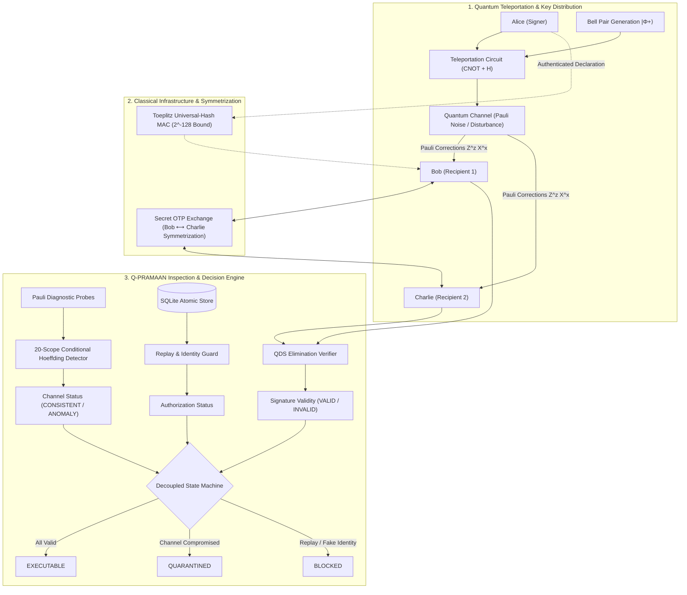

# Q-PRAMAAN

> **Quantum-Inspired Cyber Threat Detection for Digital Signature Security**  
> *Smart India Hackathon (SIH) · Problem Statement SIH26141 · Team Cache Hit (Team 125961)*

Q-PRAMAAN is a local software laboratory and assurance prototype for teleportation-based Quantum Digital Signature (QDS) security. It models a three-party signature workflow inspired by the Wallden et al. P1′ protocol, introduces a multi-verdict decision framework, and demonstrates why conventional pooled error metrics fail against targeted quantum channel manipulation—**operating entirely on quantum mechanics, projective measurement statistics, and finite-sample probability bounds without relying on AI, neural networks, or machine learning.**

---

## 1. Problem

### The Cryptographic Crisis
Post-quantum vulnerabilities threaten classical public-key infrastructures (such as RSA and ECC), which are breakable in polynomial time via Shor's algorithm. Quantum Digital Signatures (QDS) provide information-theoretic security based on fundamental quantum physical principles (the no-cloning theorem and state indistinguishability) rather than computational complexity assumptions.

### The Average-Error Paradox (Conventional Detection Blindspot)
Standard Quantum Key Distribution (QKD) and QDS monitoring architectures rely on aggregate channel metrics like Quantum Bit Error Rate (QBER):
* **The Vulnerability**: If noise is pooled across all transmitted signals, an intelligent adversary can concentrate quantum channel perturbations into a specific teleportation branch (e.g., Bell outcome `00`) or measurement basis while leaving other states undisturbed.
* **The Failure**: In a channel with a 2.0% expected pooled error, ordinary baseline noise distributes that 2.0% across all four Bell outcomes. A targeted attack applying an 8.0% error rate strictly to Bell outcome `00` and 0.0% to outcomes `01`, `10`, and `11` produces the **exact same pooled error rate of 2.0%**.
* **The Consequence**: Standard pooled detectors observe an average error well within normal tolerances and allow the session to proceed, leaving the underlying quantum communication compromised.

### SIH26141 Challenge Requirements
SIH Problem Statement 5 mandates:
1. Mathematical modeling of teleportation-based QDS with Bell pairs and Pauli corrections.
2. Threat detection covering forgery, impersonation, replay attacks, and channel manipulation.
3. Strict reliance on quantum principles (Pauli eigenstates, projective measurements, statistical thresholds) **without AI or machine learning**.
4. Information-theoretic classical authentication and verification.
5. Verifiable performance metrics, attack simulations, and an interactive prototype.

---

## 2. Approach

Q-PRAMAAN replaces opaque machine learning classifiers with deterministic, inspectable quantum statistical mechanics:

```
┌─────────────────────────────────────────────────────────────────────────────┐
│                             CORE PHILOSOPHY                                 │
├──────────────────────────────────────┬──────────────────────────────────────┤
│ ❌ No Black-Box AI / Neural Models   │ Deterministic, mathematically proven  │
│ ❌ No Single Pooled QBER Blindspot   │ 20-scope conditional Hoeffding tests │
│ ❌ No Monolithic Pass/Fail Booleans  │ 4 decoupled orthogonal decisions     │
│ ❌ No Unverified Security Claims     │ Honest bounds; unavailable if noisy  │
└──────────────────────────────────────┴──────────────────────────────────────┘
```

1. **Exact Quantum State Modeling**: Direct circuit simulation of 3-qubit teleportation ($|\Phi^+\rangle$), Alice's CNOT and Hadamard operations, and the receiver's Pauli unitary corrections ($Z^z X^x$). Projective measurement probabilities are computed directly from the circuit's Born rule tensor, not arbitrary coin tosses.
2. **Conditional Finite-Sample Threat Detection**: Instead of a single pooled average, diagnostic Pauli probes are partitioned into 20 orthogonal test scopes across Bell branches and Pauli bases. Each scope is evaluated using finite-sample one-sided Hoeffding bounds with Bonferroni union-bound family-wise error rate control ($\alpha = 0.01$).
3. **Decoupled Decision Engine**: The system strictly separates *Cryptographic Signature Validity*, *Channel Consistency*, and *Request Authorization*. An anomaly flags and quarantines execution without altering or corrupting the mathematical signature result.
4. **Information-Theoretic Defense in Depth**:
   * **Classical Transcripts**: Protected by one-time Toeplitz universal-hash MACs ($2^{-128}$ per-attempt forgery bound) with tracked key consumption.
   * **Replay Protection**: Enforced via atomic SQLite execution receipts that guarantee strictly exactly-once execution.

---

## 3. Design

### 3.1 Multi-Verdict State Machine

Rather than conflating network noise with protocol violations, Q-PRAMAAN evaluates four independent axes:

```
┌────────────────────────────────────────────────────────────────────────┐
│                          DECISION ENGINE                               │
├────────────────────────────────────────────────────────────────────────┤
│ 1. Signature Validity   : VALID | INVALID | NOT_EVALUATED              │
│ 2. Channel Status       : CONSISTENT | ANOMALY | INSUFFICIENT_EVIDENCE │
│ 3. Authorization        : AUTHORIZED | REPLAY_BLOCKED |                │
│                           IDENTITY_REJECTED | VERIFIER_DENIED          │
├────────────────────────────────────────────────────────────────────────┤
│                           OPERATIONAL ACTION                           │
│                                                                        │
│   All Passed       ──▶  EXECUTABLE (or EXECUTED upon single run)       │
│   Channel Anomaly  ──▶  QUARANTINED (Valid signature, unsafe link)     │
│   Replay/Forbidden ──▶  BLOCKED                                        │
└────────────────────────────────────────────────────────────────────────┘
```

### 3.2 The 20-Scope Detection Family

For each link and transmission phase, diagnostic probes are sampled across 20 distinct scopes, sharing a family significance budget $\alpha = 0.01$:

$$\alpha_{\text{test}} = \frac{\alpha}{\text{family\_size}} = \frac{0.01}{20} = 0.0005$$

The one-sided Hoeffding threshold for sample size $n$ and baseline error rate $q_0$ is:

$$\text{Threshold}(n) = \min\left(1.0,\; q_0 + \sqrt{\frac{\ln(1 / \alpha_{\text{test}})}{2n}}\right)$$

* **1 Pooled Scope**: Aggregate across all transmitted diagnostic probes.
* **4 Bell-Outcome Scopes**: Partitioned by teleportation measurement branches (`00`, `01`, `10`, `11`).
* **3 Basis Scopes**: Partitioned by measurement bases ($Z, X, Y$).
* **12 Joint Scopes**: Evaluated per Basis $\times$ Branch combination ($Z/00$, $X/00$, etc.).
* **Calibration & Loss Guard**: If probe loss exceeds 10%, sample count $n < 64$, or trusted baseline calibration is missing, the system outputs `INSUFFICIENT_EVIDENCE` and halts safely.

### 3.3 Protocol Operations (P1′ Adaptation)

1. **State Distribution**: Alice teleports BB84 states ($|0\rangle, |1\rangle, |+\rangle, |-\rangle$) to Bob and Charlie.
2. **State Elimination**: Bob and Charlie perform projective measurements in random bases and record the states their outcomes eliminate.
3. **Secret Symmetrization**: Bob and Charlie privately swap a random half ($\sim 50\%$) of their excluded-state records over an OTP-encrypted classical channel, ensuring neither recipient can forge a forwarded declaration.
4. **Verification**: Mismatches between declaration and retained excluded states must remain strictly below threshold $s_a L$ (for Bob's direct verification) and $s_v L$ (for Charlie's forwarded verification), with $s_a = 0.02$ and $s_v = 0.04$.

---

## 4. Architecture

### System Flow Diagram



### Module Directory Structure

```
Q-PRAMAAN/
├── SIH26141.md               # Problem statement specifications
├── qpramaan/
│   ├── quantum.py            # 3-qubit circuit, Bell teleportation, Born probability tensor
│   ├── protocol.py           # P1' QDS: BB84 state elimination, symmetrization, verification
│   ├── detection.py          # 20-scope Hoeffding detector, Bonferroni union bounds
│   ├── attacks.py            # 13 simulated attack and channel disturbance scenarios
│   ├── auth.py               # One-time Toeplitz universal-hash MAC with pad tracking
│   ├── store.py              # SQLite audit store, atomic exactly-once execution receipt
│   ├── planner.py            # Wallden et al. reference security bounds and Bell-pair planner
│   ├── experiments.py        # Central harness tying quantum, detection, auth, and store
│   ├── server.py             # Loopback HTTP server (Content-Security-Policy & origin guards)
│   ├── evidence.py           # Independent auditor CLI to recompute JSON report arithmetic
│   └── benchmark.py          # Vectorized benchmark runner for multi-scenario evaluation
├── web/                      # Frontend dashboard (Vanilla HTML, CSS, JavaScript)
│   ├── index.html            # Laboratory, Evidence, Planner, and Benchmark views
│   ├── style.css             # Dark-mode glassmorphic theme and responsive layouts
│   └── app.js                # Interactive visualization, REST integration, JSON download
├── tests/
│   └── test_core.py          # Unit tests covering circuit fidelity, attacks, auth, and store
├── output/
│   └── benchmark.json        # Reproducible 20,000-trial benchmark records and timings
└── requirements.txt          # Python dependencies (NumPy >= 1.24, < 3)
```

---

## 5. Proof of Work (Benchmarks, Tests & Verification)

### 5.1 Core Verification Suite (Unit Tests)

All 8 automated tests validate the core quantum, cryptographic, and operational assertions:

```powershell
python -m unittest discover -s tests -v
```

```
test_equal_average_channel_needs_conditional_checks ... ok
test_missing_data_never_passes_as_normal ............ ok
test_one_time_authentication_rejects_tamper_and_reuse ok
test_planner_refuses_unsupported_noise_model ......... ok
test_replay_preserves_signature_validity ............. ok
test_signature_forwarding_and_recipient_view_forgery . ok
test_targeted_channel_affects_signature_delivery ..... ok
test_teleportation_all_pauli_eigenstates_and_outcomes  ok

----------------------------------------------------------------------
Ran 8 tests in 0.192s

OK
```

* **Quantum Circuit Precision**: `correctness()` executes all 24 Pauli eigenstate $\times$ Bell branch combinations. The minimum state fidelity is **`0.9999999999999996`** ($1.0$ to floating point limits) and the maximum branch probability deviation is $< 1.11 \times 10^{-16}$.
* **Classical Authentication**: Proves that modifying a single message byte or reusing a one-time key immediately fails authentication.
* **Atomic Replay Guard**: Proves that a signature remains valid on subsequent submissions, while the execution receipt triggers `REPLAY_BLOCKED`.

---

### 5.2 Threat Detection Benchmark (20,000 Trials per Scenario)

The benchmark evaluates 120,000 diagnostic batches (20,000 per scenario) with $n = 2,048$ probes per branch ($8,192$ probes per batch) at $\alpha = 0.01$:

```powershell
python -m qpramaan.benchmark --trials 20000 --protocol-trials 200 --output output/benchmark.json
```

| Channel Scenario | Target / Disturbance Type | Expected Pooled Error | Standard Pooled Detector (Flags / 20,000) | Q-PRAMAAN Conditional Detector (Flags / 20,000) | Detection Rate (Wilson 95% CI) |
|---|---|:---:|:---:|:---:|:---:|
| **Ordinary Noise** | Uniform 2% in all Bell branches | 2.0% | **0 / 20,000** (0.0%) | **0 / 20,000** (0.0%) | 0.0% (0.0% – 0.019%)<br>*Zero False Alarms* |
| **Targeted Manipulation** | 8% in branch `00`, 0% in `01`, `10`, `11` | 2.0% | **0 / 20,000** (0.0%)<br>*Completely Blind* | **19,967 / 20,000** (99.84%) | **99.84%** (99.77% – 99.88%)<br>*Identified via Branch 00* |
| **Benign Drift** | Uniform 8% in all branches | 8.0% | 20,000 / 20,000 (100%) | 20,000 / 20,000 (100%) | 100.0% (99.98% – 100%) |
| **Intercept & Resend** | Eve measures in random basis and resends | 34.0% | 20,000 / 20,000 (100%) | 20,000 / 20,000 (100%) | 100.0% (99.98% – 100%) |
| **Sparse Disturbance** | 1 in 10 signals in branch `00` disturbed | 2.15% | 0 / 20,000 (0.0%) | 0 / 20,000 (0.0%) | *Below sensitivity threshold* |
| **Indistinguishable** | Adversarial noise matches baseline marginals | 2.0% | 0 / 20,000 (0.0%) | 0 / 20,000 (0.0%) | *Observable envelope identical* |

#### Key Insights from the Data:
1. **The Core Proof**: Under **Targeted Manipulation**, the pooled detector fails on all 20,000 batches because the pooled error remains at 2.0%. Q-PRAMAAN flags **19,967 out of 20,000 batches (99.84%)** because its branch-specific test exposes the 8% localized error.
2. **Zero False Positives**: On **Ordinary Noise**, neither detector triggered a false alarm across 20,000 trials, confirming strict adherence to the family error bound ($\alpha = 0.01$).
3. **Scientific Transparency**: The **Sparse** and **Indistinguishable** scenarios confirm that statistical detectors operate strictly within finite-sample bounds: disturbances smaller than the Hoeffding margin or structurally identical to the baseline are not overclaimed.

---

### 5.3 Protocol Attack Simulations (200 Full Trials)

Evaluated with signature element count $L = 2,048$:

| Protocol Trial Type | Successes / Total | Success Rate (Wilson 95% CI) | Cryptographic Meaning |
|---|:---:|:---:|---|
| **Honest Recipient Accept** | 200 / 200 | **100.0%** (98.1% – 100.0%) | Deterministic agreement for legitimate signatures. |
| **Dishonest Recipient Forgery** (Bob $\rightarrow$ Charlie) | 0 / 200 | **0.0%** (0.0% – 1.88%) | Excluded-state symmetrization prevents Bob from guessing Charlie's key. |
| **Signer Repudiation** (Alice) | 0 / 200 | **0.0%** (0.0% – 1.88%) | Inconsistent state distributions fail forwarded verification thresholds. |
| **Symmetrization Setup Abort** | 0 / 200 | **0.0%** (0.0% – 1.88%) | The secret exchange reliably satisfies the $[0.45L, 0.55L]$ quota. |

---

### 5.4 Performance & Scalability

Measured on standard commodity hardware (Python 3.11 / NumPy 2.4):

| Signature Length ($L$) | Bell Pairs ($4L$) | Median End-to-End Latency | Complexity |
|:---:|:---:|:---:|:---:|
| **1,024** | 4,096 | **0.30 ms** | $O(L)$ |
| **4,096** | 16,384 | **0.86 ms** | $O(L)$ |
| **16,384** | 65,536 | **3.65 ms** | $O(L)$ |
| **65,536** | 262,144 | **14.83 ms** | $O(L)$ |

* **High-Throughput Vectorization**: The entire 120,000-sample benchmark and 200 protocol runs execute in **0.67 seconds**.
* **Zero AI Overhead**: Runs with standard Python standard library and NumPy—no GPUs, PyTorch, TensorFlow, or model loading latency.

---

### 5.5 Independent Evidence Auditing

Any generated report can be exported from the dashboard as a JSON file and independently recomputed via the CLI to audit calculation integrity:

```powershell
python -m qpramaan.evidence path\to\report.json
```

```json
{
  "matches": true,
  "recomputed_status": "ANOMALY",
  "meaning": "Checks statistical calculation only; it does not establish provenance or physical security."
}
```

---

## 6. Getting Started

### Prerequisites
* Windows PowerShell (or Linux/macOS bash)
* Python 3.10+
* NumPy >= 1.24, < 3

### Installation & Launch

```powershell
# 1. Clone repository and navigate to folder
cd c:\dev\quantum\Q-PRAMAAN

# 2. Set up virtual environment and install dependencies
python -m venv .venv
.\.venv\Scripts\python.exe -m pip install -r requirements.txt

# 3. Launch the laboratory dashboard
.\run.ps1
```

Once running, navigate to **`http://127.0.0.1:8765`** in your browser.

### Dashboard Views
* **Laboratory**: Select from 13 attack and channel scenarios, inspect the 4 decoupled verdicts, and execute simulated releases.
* **Evidence**: View visual diagnostic distributions, individual branch error rates, and download audit JSON receipts.
* **Resource Planner**: Interactively calculate required Bell pairs and Classical bits across target security parameters ($10^{-3}$ to $10^{-9}$).
* **Evaluation**: Compare pooled vs. conditional detection rates with real-time benchmark results.

---

## 7. Scientific Scope & Limitations

* **Assurance Prototype**: Q-PRAMAAN is a software simulation designed to analyze detection mechanics and protocol behavior. It is not physical device hardware.
* **Attribution vs. Detection**: A statistical channel anomaly indicates departure from the declared baseline; measurement counts alone cannot mathematically deduce the attacker's physical identity or human intent.
* **Planner Scope**: Published Wallden et al. bounds are displayed only when ideal authenticated channel assumptions apply. For noisy or tampered channels, the planner explicitly reports **Bound Unavailable for This Model** rather than extrapolating unproven theoretical claims.

---

## 8. Academic References

1. **Wallden et al. (2014)**: *Quantum digital signatures with quantum key distribution components*. [arXiv:1403.5551](https://arxiv.org/abs/1403.5551).
2. **Gottesman & Chuang (2001)**: *Quantum Digital Signatures*. [arXiv:quant-ph/0105032](https://arxiv.org/abs/quant-ph/0105032).
3. **Nadeem & Wang (2015)**: *Quantum digital signature scheme with quantum teleportation*. [arXiv:1507.03581](https://arxiv.org/abs/1507.03581).
4. **IBM Quantum Learning**: *Quantum Teleportation & Correction Circuits*. [IBM Quantum Learning](https://quantum.cloud.ibm.com/learning/en/courses/basics-of-quantum-information/entanglement-in-action/quantum-teleportation).

